  🌐 Language: <a href="./README.md">🇬🇧 English</a> | <a href="./README.zh.md">🇨🇳 中文</a>

# 👋 Hi, I'm Aldrin (agnostic-ap)

I'm a full-stack developer from China 🇨🇳 with extensive experience in building web applications, cross-platform solutions, automation tools, and mobile apps. I specialize in frontend frameworks like Vue and React, mobile development with Kotlin and Uniapp, and backend integration using Laravel, Spring Boot, and cloud services.

---

## 🧠 Tech Stack & Skills

- **Frontend**: Vue2 / Vue3 / Nuxt / React / Next.js / Tailwind CSS / TypeScript / JavaScript (ES6+)
- **Mobile**: Kotlin (Android), Uniapp, TRTC, Tencent IM, WeChat Mini Programs
- **Backend**: Laravel (PHP), Spring Boot (Java), RESTful APIs, OAuth2
- **DevOps & Infra**: MySQL, Redis, Alibaba Cloud OSS, Linux-based deployment (VPS)
- **Automation**: Lua, Easy Language (易语言), XXTouch, auto-scripting (100+ commercial scripts delivered)
- **AI Integration**: Tongyi Qianwen (阿里通义千问), OpenAI API (ChatGPT/Whisper)
- **Workflow**: Git, CI/CD, async remote collaboration, modular component architecture

---

## 🚀 Highlight Projects

### 🏘️ New Zealand Housing Platform

> A full-stack rental platform for the local New Zealand market

- **Tech**: React + Next.js + Tailwind CSS + MySQL
- **Highlights**: frontend architecture, backend API integration, SEO optimization, multi-end deployment

---

### 🛒 Cross-Platform Shopping App (WeChat Mini Program)

> A Uniapp-based mall app delivered to a New Zealand client

- **Tech**: Vue2 + Uniapp + Sass + Vue Router
- **Highlights**: product catalog, cart system, mini program export, real-world deployment

---

### 📱 Android Real-time Chat & Video App

> A native Android mobile app with real-time communication

- **Tech**: Kotlin + Jetpack Compose + TRTC + Tencent IM
- **Highlights**: video chat, messaging, WeChat login integration, full-stack delivery

---

## 🌍 Remote Work Readiness

- ✅ 3+ years of freelance & remote collaboration experience (NZ market focus)
- ✅ Familiar with GitHub issues, PR review, documentation, async workflows
- ✅ Fluent in reading technical English; actively preparing for IELTS
- ✅ Comfortable working across time zones & delivering independently

---

## 📫 Contact

- GitHub: [@agnostic-ap](https://github.com/agnostic-ap)
- Email: <dc23byte@gmail.com>
- Portfolio / Blog: [https://gt2kk.cn](https://gt2kk.cn)

---

## 📊 GitHub Stats

---

_Thanks for visiting! Feel free to connect and collaborate._ 🤝
